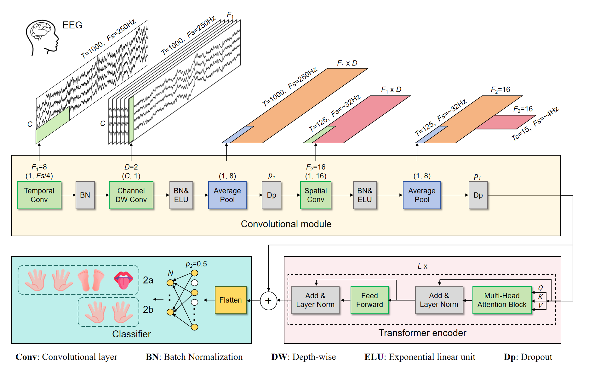
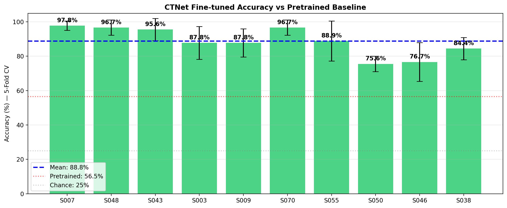
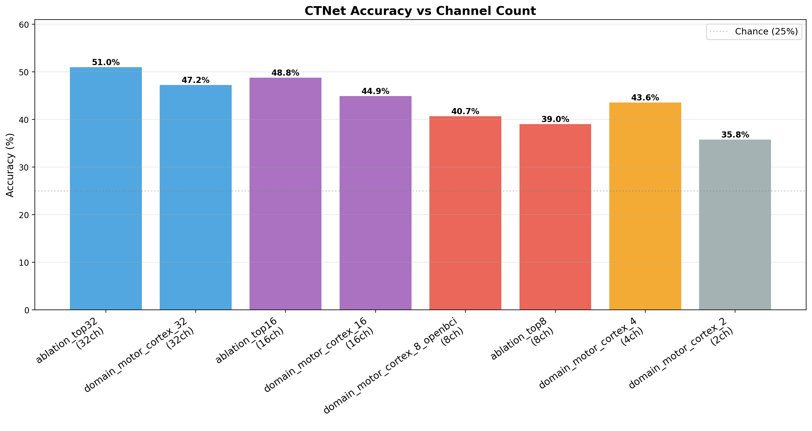
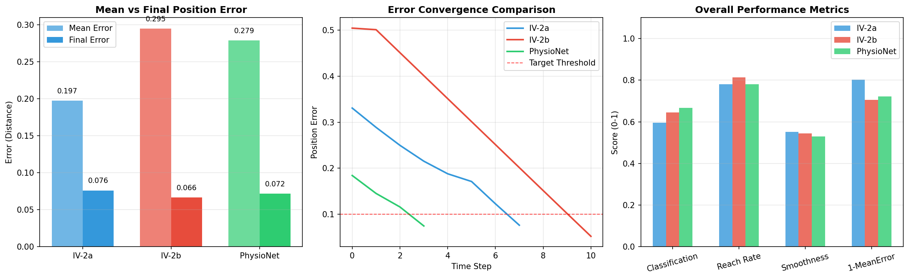

# 基于深度学习的 BCI 机械臂闭环控制系统

适合面试讲述的项目版 PPT

- 目标：把嘈杂的运动想象 EEG 信号转成稳定的机械臂控制
- 方法：`EEGTransformer + Transfer Learning + Transformer DQN`
- 亮点：`82.22%` 感知精度下，闭环控制仍达到 `99%` 成功率

::: notes
这一页建议 20 到 30 秒。

可以直接说：
“这个项目不是只做 EEG 分类，而是做一个完整的闭环控制系统。我负责了 EEG 预处理、Transformer 分类器、强化学习控制器、仿真验证，以及面向 OpenBCI 和 SO-101 的部署接口。”
:::

# 我解决的问题

传统 MI-BCI 机械臂控制的三个瓶颈：

- `信号非平稳`：跨人、跨天、跨会话差异大，模型泛化困难
- `开环控制脆弱`：单次分类错误会直接带偏机械臂动作
- `硬件难部署`：实验室常用 64 通道，实际更需要 8 通道消费级设备

我的目标不是只提升分类精度，而是：

- 做一个 `从感知到决策再到执行` 的闭环系统
- 证明 `不完美感知` 下依然能实现稳定控制
- 让方案具备 `OpenBCI + 真实机械臂` 的部署基础

::: notes
这一页要把项目讲成系统问题，而不是单纯论文问题。

推荐讲法：
“如果把 EEG 分类器看成感知模块，这个项目本质上是在做感知有噪声时，控制系统如何保持鲁棒。这和机器人里的感知误差、决策纠错、闭环控制是同一个问题。”
:::

# 系统架构

{width=84%}

::: notes
这一页顺着图从左往右讲。

重点强调：
“我没有把分类结果直接映射成动作，而是把它作为决策输入的一部分，让 DQN 在闭环环境里学习纠错，所以系统对分类误差更鲁棒。”
:::

# 核心算法：EEGTransformer 与迁移学习

分类器设计思路：

- `CNN front-end`：提取 EEG 空间模式，形成数据驱动空间滤波
- `Transformer encoder`：建模 4 秒 EEG 序列的长时依赖
- `Transfer learning`：跨被试预训练 + 个体微调，降低校准成本

核心结果：

- `BCI IV-2a`：`73.80%`
- `BCI IV-2b`：`82.87%`
- `PhysioNet`：跨被试 `56.54%`，微调后 `88.78%`
- 微调带来 `+32` 个百分点提升

::: notes
这里不要只说“用了 Transformer”，而要说“为什么这样设计”。

可以这样讲：
“单纯 CNN 擅长局部模式，单纯 Transformer 又缺少 EEG 的空间 inductive bias，所以我把两者结合。再通过跨被试预训练和个体微调，把泛化性和可部署性结合起来。”
:::

# 迁移学习效果

{width=82%}

::: notes
这一页建议用来强化“泛化能力”和“低校准成本”。
:::

# 迁移学习结论

- 109 人跨被试预训练得到可迁移表征
- 只用较少个体数据微调，就能把精度拉到 `88.78%`
- 说明模型学到的是可迁移的 MI 结构，而不是单个被试的偶然模式

::: notes
推荐讲法：
“对真实系统来说，最重要的不是离线刷高分，而是新用户接入时能否快速适配。这里的结果说明预训练模型确实提供了一个强初始化。”
:::

# 8 通道部署与预处理取舍

部署不是简单降配，而是做了系统化验证：

- 用 `leave-one-channel-out` 消融找关键电极，结果显示 `C3` 最关键
- 设计 OpenBCI 兼容的 8 通道集合：`C3/C4/FC3/FC4/CP3/CP4/Cz/FCz`
- 8 通道下经过个体微调，平均精度仍达到 `72.54%`
- 预处理消融显示：`8-30 Hz` 带通滤波平均 `+18.44%`，`ICA` 仅 `+1.51%`

::: notes
这一页要体现工程判断，不是把复杂方法都堆上去。

可以说：
“我做了可控消融后发现，带通滤波是必要的，但 ICA 收益很小且不稳定，所以最终主流程保留 bandpass-only。这种取舍更适合真实部署。”
:::

# 8 通道部署结果图

{width=78%}

::: notes
这页用图辅助说明，不需要讲太久。
:::

# 8 通道结论

- 在显著减少通道数后，系统仍保留可用控制潜力

::: notes
一句话即可：
“这张图说明性能会随着通道数减少而下降，但 8 通道在微调后仍然保留了可部署价值，不是简单失效。”
:::

# 闭环决策：Transformer DQN

我把控制问题建模成 MDP：

- 状态：末端位置、目标位置、距离，以及可选的 `EEG 预测 + 置信度`
- 动作：`左 / 右 / 上 / 下`
- 奖励：到达目标奖励、距离改善奖励、步数惩罚、越界/震荡惩罚

架构对比：

- `CNN+LSTM`：`97%` reach rate
- `Light Transformer`：`99%`
- `Transformer DQN`：`100%`，最终 reward 最高

::: notes
这里要把项目讲成“决策算法”。

可以说：
“分类器只负责提供有噪声的方向线索，真正决定动作的是闭环 DQN。它结合当前状态连续修正轨迹，所以本质上是在学习一个鲁棒决策策略。”
:::

# 端到端结果：82% 感知精度下实现 99% 控制成功率

{width=82%}

::: notes
先给图，再在下一页讲结论。
:::

# 端到端结论

- EEGTransformer 分类精度：`82.22%`
- 闭环 DQN 目标到达率：`99.0%`
- 加入 EEG 预测后，训练时间从 `1130s` 降到 `668s`

结论：

- 开环“分类即控制”不够稳
- 闭环“感知 + 决策 + 纠错”明显更可靠

::: notes
这是最关键的一页。

建议直接讲：
“最能说明项目价值的不是单个分类指标，而是分类只有 82.22% 时，控制成功率仍然有 99%。这说明闭环决策模块真正吸收了感知噪声。”
:::

# 工程实现与验证边界

我实际完成的模块：

- `MNE / PyTorch`：EEG 数据处理、训练、微调、评估
- `PyBullet`：机械臂控制仿真与 RL 训练环境
- `BrainFlow`：OpenBCI 实时 EEG 流接口
- `Serial / 机械臂控制`：SO-101 串口协议与动作执行

当前边界：

- 已完成 `完整软件链路` 与 `仿真验证`
- 已实现 `OpenBCI 接口` 和 `SO-101 控制接口`
- 由于伦理审批限制，`未做真人在线闭环实验`

::: notes
这里要诚实区分“已验证”和“待验证”。

可用说法：
“我已经把面向真实系统需要的软件链路和硬件接口都打通了，但真人在线闭环实验还没做，所以我会明确把这部分说成 deployment-ready interface，而不是 fully validated live system。”
:::

# 如何把它讲成机器人决策算法项目

这套项目经验可直接映射到机器人岗位：

- `感知不确定性处理`：EEG 分类噪声，等价于机器人感知误差
- `决策算法设计`：DQN 在闭环中基于状态和预测做动作选择与纠错
- `仿真到部署`：先在 PyBullet 验证，再对接 OpenBCI 与机械臂接口
- `系统联调能力`：数据、模型、控制、通信链路由我独立打通

一句话总结：

`我做的不是单一分类模型，而是一个在不完美感知条件下，仍能稳定完成控制任务的闭环决策系统。`

::: notes
最后一页用于收束。

如果面试官偏机器人方向，可以落到：
“虽然任务载体是 BCI 机械臂，但我解决的问题本质上是感知-决策-执行闭环鲁棒性，这和机器人决策算法岗位关注的问题高度一致。”
:::
